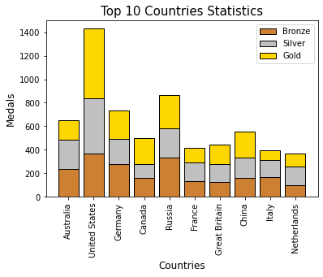
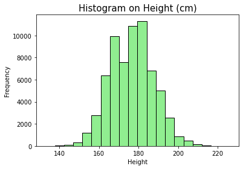
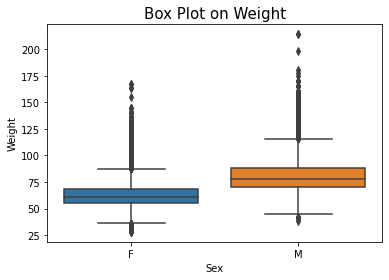
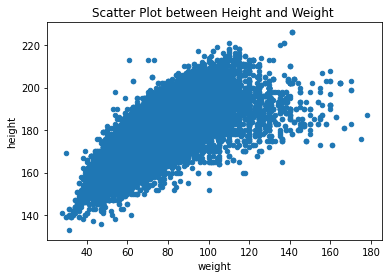

# Analysis-of-16-years-of-the-Olympic-Games
The ‘Modern Olympics’ comprises all the Games from Athens 1896 to South Korea 2018. The Olympics is more than just a quadrennial multi-sport world championship. It is a lense through which to understand global history, including shifting geopolitical power dynamics, women’s empowerment, and the evolving values of society.

The goal of the project was to perform some analysis on the people participating in sports. For this reason we decided to look at the Olympic games as it has been held for over 100 years and is well recorded. This allowed us to shed light on major insights in modern Olympic history through various analyses on the data such as correlations, numerical patterns, verification of hypotheses etc.

## Below are Few Results of this Analysis:

  |  
:-------------------------:|:-------------------------:
  |  

